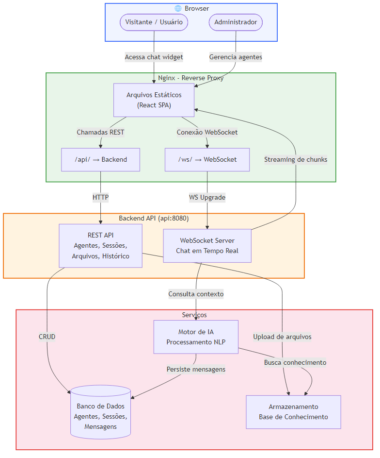

# Avachat - Plataforma de Agentes de IA para Atendimento


## Overview

**Avachat** é uma plataforma para criar agentes de IA personalizados que conversam com visitantes do seu site em tempo real. Permite criar agentes com prompts customizados, alimentá-los com uma base de conhecimento (documentos e FAQs) e coletar dados de leads (nome, email, telefone) de forma natural durante a conversa. Construído com **React 19**, **TypeScript 6**, **Vite 8** e **Tailwind CSS 4**, com comunicação em tempo real via **WebSocket** e gerenciamento de estado com **Zustand**.

---

## 🚀 Features

- 🤖 **Agentes inteligentes** - Crie agentes com prompts de sistema personalizados que entendem o contexto do seu negócio
- 📚 **Base de conhecimento** - Upload de documentos para respostas precisas e contextualizadas (com status de processamento)
- 💬 **Chat em tempo real** - Respostas com streaming via WebSocket — visitantes veem a IA respondendo em tempo real
- 👤 **Coleta de leads** - Capture nome, email e telefone de forma conversacional, configurável por agente
- 🎨 **Widget embeddable** - Componente de chat pronto para integrar em qualquer site, com cores e avatar customizáveis
- 📊 **Histórico de conversas** - Painel administrativo com sessões e mensagens paginadas
- 🔗 **Acesso por slug** - Cada agente tem um slug único para acesso direto via URL (`/chat/:slug`)
- ⚡ **Ativação/desativação** - Toggle de status dos agentes sem necessidade de exclusão

---

## 🛠️ Technologies Used

### Core Framework
- **React 19** - Biblioteca para construção da interface
- **TypeScript 6** - Tipagem estática para maior segurança do código
- **Vite 8** - Build tool com HMR ultrarrápido

### Estilização
- **Tailwind CSS 4** - Framework CSS utility-first
- **@tailwindcss/typography** - Plugin para estilização de conteúdo rich text (Markdown)

### Estado e Comunicação
- **Zustand** - Gerenciamento de estado leve e performático
- **WebSocket nativo** - Comunicação em tempo real para o chat

### Bibliotecas Adicionais
- **React Router DOM 7** - Roteamento SPA
- **React Markdown** - Renderização de Markdown nas respostas do agente
- **React Dropzone** - Upload de arquivos com drag-and-drop

### DevOps
- **Docker** - Containerização com multi-stage build (Node + Nginx)
- **Nginx** - Servidor web e reverse proxy para API e WebSocket
- **GitHub Actions** - CI/CD com versionamento automático (GitVersion)
- **ESLint 9** - Linting com regras para React Hooks e React Refresh

---

## 📁 Project Structure

```
avachat-app/
├── .github/
│   └── workflows/           # CI/CD pipelines
│       ├── version-tag.yml  # Versionamento automático com GitVersion
│       ├── npm-publish.yml  # Publicação no NPM
│       └── create-release.yml # Criação de releases no GitHub
├── docs/                    # Documentação e diagramas
├── public/                  # Assets estáticos (imagens, ícones)
├── specs/                   # Especificações de features
│   ├── 001-landing-chat-widget/
│   └── 002-chat-start-session/
├── src/
│   ├── Services/            # Camada de serviços (API calls)
│   │   ├── AgentService.ts
│   │   ├── ChatHistoryService.ts
│   │   └── KnowledgeFileService.ts
│   ├── components/
│   │   ├── admin/           # Componentes do painel administrativo
│   │   ├── chat/            # Componentes do chat (Widget, Bubble, Window)
│   │   └── common/          # Componentes compartilhados (404, Unavailable)
│   ├── hooks/               # Custom hooks
│   │   ├── useChat.ts       # Lógica de chat via WebSocket
│   │   ├── useChatWidget.ts # Orquestração do widget
│   │   └── useWebSocket.ts  # Conexão WebSocket genérica
│   ├── pages/               # Páginas da aplicação
│   │   ├── admin/           # Páginas administrativas
│   │   └── chat/            # Página de chat por slug
│   ├── stores/              # Zustand stores
│   ├── types/               # TypeScript types e interfaces
│   ├── App.tsx              # Rotas da aplicação
│   └── main.tsx             # Entry point
├── Dockerfile               # Multi-stage build (Node → Nginx)
├── GitVersion.yml           # Configuração de versionamento semântico
├── nginx.conf               # Configuração do Nginx (proxy reverso)
├── package.json             # Dependências e scripts
├── vite.config.ts           # Configuração do Vite
└── README.md                # Este arquivo
```

---

## 🏗️ System Design

O diagrama abaixo ilustra a arquitetura de alto nível do **Avachat**:



**Componentes principais:**
- **Browser** — O frontend React SPA é servido como arquivos estáticos pelo Nginx
- **Nginx** — Atua como servidor web e reverse proxy, encaminhando chamadas REST (`/api/`) e WebSocket (`/ws/`) para o backend
- **Backend API** — Serviço em `api:8080` que expõe a REST API e o servidor WebSocket para chat em tempo real
- **Serviços** — Motor de IA para processamento de linguagem natural, banco de dados para persistência e armazenamento para a base de conhecimento

> 📄 **Source:** O arquivo Mermaid editável está disponível em [`docs/system-design.mmd`](docs/system-design.mmd).

---

## ⚙️ Environment Configuration

Antes de executar a aplicação, configure as variáveis de ambiente:

### 1. Crie o arquivo `.env`

```bash
cp .env.production .env
```

### 2. Edite o `.env`

```bash
# URL base da API backend
VITE_API_URL=http://localhost:5000

# URL do WebSocket
VITE_WS_URL=ws://localhost:5000
```

⚠️ **IMPORTANTE**:
- Em produção, configure `VITE_API_URL` e `VITE_WS_URL` para apontar para o servidor real
- As variáveis com prefixo `VITE_` são expostas no bundle do cliente

---

## 🐳 Docker Setup

### Quick Start com Docker

#### 1. Build da imagem

```bash
docker build -t avachat-app .
```

#### 2. Executar o container

```bash
docker run -d -p 80:80 --name avachat-app avachat-app
```

#### 3. Verificar

Acesse [http://localhost](http://localhost) no navegador.

### Serviços (via Nginx proxy)

| Serviço | URL |
|---------|-----|
| **Frontend SPA** | http://localhost |
| **API (proxy)** | http://localhost/api/ |
| **WebSocket (proxy)** | ws://localhost/ws/ |

> **Nota:** O Nginx faz proxy reverso para `http://api:8080`. Certifique-se de que o backend esteja acessível com o hostname `api` na mesma rede Docker.

---

## 🔧 Setup Manual (Sem Docker)

### Pré-requisitos

- **Node.js** 20+
- **npm** 10+
- Backend API rodando (padrão: `http://localhost:5000`)

### Passos

#### 1. Instalar dependências

```bash
npm install
```

#### 2. Configurar variáveis de ambiente

```bash
cp .env.production .env
# Edite .env com as URLs do seu backend
```

#### 3. Iniciar em modo desenvolvimento

```bash
npm run dev
```

#### 4. Build para produção

```bash
npm run build
```

#### 5. Preview do build

```bash
npm run preview
```

---

## 🔄 CI/CD

### GitHub Actions

O projeto possui 3 workflows automatizados:

| Workflow | Trigger | Descrição |
|----------|---------|-----------|
| **Version and Tag** | Push na `main` | Calcula versão semântica via GitVersion e cria tag |
| **Create Release** | Após Version and Tag | Cria GitHub Release para mudanças minor/major |
| **Publish to NPM** | Tag `v*` criada | Publica o pacote no NPM |

**Estratégia de versionamento:**
- `main` → Patch increment
- `develop` → Minor increment (tag `alpha`)
- `feature/*` → Minor increment (tag `alpha`)
- `release/*` → Patch increment (tag `beta`)
- `hotfix/*` → Patch increment
- Commits com prefixo `major:` ou `breaking:` → Major bump
- Commits com prefixo `feat:` → Minor bump
- Commits com prefixo `fix:` → Patch bump

---

## 📚 API Endpoints Consumidos

O frontend consome os seguintes endpoints do backend:

### Agentes

| Método | Endpoint | Descrição |
|--------|----------|-----------|
| GET | `/api/agents` | Listar todos os agentes |
| GET | `/api/agents/:slug` | Buscar agente por slug |
| GET | `/api/agents/:slug/chat-config` | Configuração de chat do agente |
| POST | `/api/agents` | Criar novo agente |
| PUT | `/api/agents/:id` | Atualizar agente |
| DELETE | `/api/agents/:id` | Excluir agente |
| PATCH | `/api/agents/:id/status` | Ativar/desativar agente |

### Sessões e Mensagens

| Método | Endpoint | Descrição |
|--------|----------|-----------|
| POST | `/api/agents/:slug/sessions` | Iniciar sessão de chat |
| GET | `/api/agents/:id/sessions` | Listar sessões (paginado) |
| GET | `/api/sessions/:id/messages` | Listar mensagens (paginado) |

### Base de Conhecimento

| Método | Endpoint | Descrição |
|--------|----------|-----------|
| GET | `/api/agents/:id/files` | Listar arquivos do agente |
| POST | `/api/agents/:id/files` | Upload de arquivo |
| DELETE | `/api/agents/:id/files/:fileId` | Excluir arquivo |
| POST | `/api/agents/:id/files/:fileId/reprocess` | Reprocessar arquivo |

### WebSocket

| Tipo | Endpoint | Descrição |
|------|----------|-----------|
| WS | `/ws/` | Conexão WebSocket para chat em tempo real |

**Mensagens WebSocket:**
- `ready` — Conexão pronta
- `message` (envio) — Mensagem do usuário
- `chunk` (recebimento) — Chunk de resposta (streaming)
- `done` — Resposta completa
- `error` — Erro no processamento

---

## 🔍 Troubleshooting

### Problemas Comuns

#### Chat widget não conecta

**Verificar:**
```bash
# Testar se o backend está acessível
curl http://localhost:5000/api/agents
```

**Causas comuns:**
- Backend não está rodando
- Variáveis `VITE_API_URL` / `VITE_WS_URL` incorretas
- CORS não configurado no backend

#### Build falha com erros de tipo

**Verificar:**
```bash
npx tsc --noEmit
```

**Solução:**
- Verifique que as versões das dependências `@types/react` e `@types/react-dom` são compatíveis com React 19

---

## 🚀 Deployment

### Desenvolvimento

```bash
npm run dev
```

### Produção (Docker)

```bash
docker build -t avachat-app .
docker run -d -p 80:80 avachat-app
```

---

## 🤝 Contributing

Contribuições são bem-vindas! Sinta-se à vontade para abrir um Pull Request.

### Setup de Desenvolvimento

1. Fork o repositório
2. Crie uma branch de feature (`git checkout -b feature/MinhaFeature`)
3. Faça suas alterações
4. Execute o lint (`npm run lint`)
5. Commit suas mudanças (`git commit -m 'feat: adiciona MinhaFeature'`)
6. Push para a branch (`git push origin feature/MinhaFeature`)
7. Abra um Pull Request

### Padrões de Código

- TypeScript strict mode
- ESLint com regras para React Hooks
- Commits seguindo Conventional Commits (`feat:`, `fix:`, `major:`)
- Componentes funcionais com hooks

---

## 👨‍💻 Author

Desenvolvido por **[Emagine](https://github.com/emaginebr)**

---

## 📄 License

Este projeto está licenciado sob a **MIT License** - veja o arquivo [LICENSE](LICENSE) para detalhes.

---

## 🙏 Acknowledgments

- Construído com [React](https://react.dev)
- Estilizado com [Tailwind CSS](https://tailwindcss.com)
- Bundled com [Vite](https://vite.dev)
- Estado gerenciado com [Zustand](https://zustand.docs.pmnd.rs)

---

## 📞 Support

- **Issues**: [GitHub Issues](https://github.com/emaginebr/avachat-app/issues)
- **Discussions**: [GitHub Discussions](https://github.com/emaginebr/avachat-app/discussions)

---

**⭐ Se você achou este projeto útil, considere dar uma estrela!**
